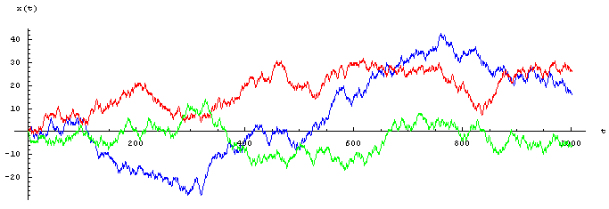

```{r setup, include=FALSE}
knitr::opts_chunk$set(echo = TRUE)
```
```{r, include=FALSE}
options(tinytex.verbose = TRUE)
```

<style>
  .col2 {
    columns: 2 200px;         /* number of columns and width in pixels*/
    -webkit-columns: 2 200px; /* chrome, safari */
    -moz-columns: 2 200px;    /* firefox */
  }

</style>

## Introduction

La marche aléatoire est un modèle mathématique qui permet de prédire le mouvement d'un système en fonction de son point de départ. On peut l'appeler également par marche de l'ivrogne, car Selon Pearson: 

_"Dans un pays ouvert, l'endroit le plus probable pour trouver un ivrogne encore capable de tenir sur ses pieds se trouve quelque part dans le voisinage de son point de départ."_ 
```{r cars}

```

## Présentation

Les pas de la marche aléatoire sont totalement décorrélés les uns des autres. Cela signifie intuitivement qu'à chaque instant, le futur du système dépend de son état présent, mais pas de son passé, même le plus proche. Autrement dit, le système « perd la mémoire » à mesure qu'il évolue dans le temps. (Une autre raison pour "la marche de l'ivrogne")

Google utilise la marche aléatoire pour parcourir, identifier et classer les pages du réseau internet. 

La marche aléatoire est décomposée en une unité de base appelée _pas_, et sa longueur elle-même peut être constante, aléatoire ou fixée par le réseau ou les graphiques que nous voulons parcourir. Par conséquent, à chaque étape, nous avons une gamme de possibilités pour sélectionner au hasard la direction et la taille du pas. Cette gamme de possibilités peut être discrète (choisir parmi un nombre limité de valeurs) ou continue.

### Exemple simple

Une puce se trouve à l'instant t=0 en un point appelé origine. Chaque seconde, elle peut faire un pas vers la gauche, ou vers la droite, ou vers le haut ou vers le bas, avec une égale probabilité. La puce décrit ce que l'on appelle une marche aléatoire dans le plan.

{width=50%}

## Présentation formelle


Soit $d\geq 1$ et soit $(e_1,\dots, e_d)$ la base canonique de $\mathbb{Z^d}$. Soit $(X_i)$ une suite de variable aléatoires indépendantes à valeurs dans $\{(\pm e_1,\dots,\pm e_d)\}$. On appelle marche aléatoire associée la suite de variables aléatoires $(S_n)_{n\geq 1}$ où $S_n$ est défini par $$ S_n=X_1+\dots+X_n. $$


Lors de l'étude des marches aléatoires, nous souhaitons savoir si le système revient à son point de départ, c'est-à-dire s'il revient à son origine.

On dit que la marche alétoire est récurrente si: 

$$ P(S_n=0\textrm{ infiniment souvent})=1.$$
On dit que la marche aléatoire est transiente si:

$$ P(S_n=0\textrm{ infiniment souvent})=0. $$

On considère une marche aléatoire sur $\mathbb Z^d$ telle que $$P(X_i=e_j)=P(X_i=-e_j)=\frac 1{2d }$$
pour tout $i\geq 1$ et tout $j\in\{1,\dots,d\}$.
Alors:  
- La marche aléatoire est récurrente si $d=1$ ou $d=2$  
- La marche aléatoire est transiente si $d\geq 3$  

## Marche aléatoire isotrope
Imaginons un individu sur un escalier qui tire à pile ou face pour décider si le prochain pas sera vers le haut ou vers le bas. À chaque étape, il n'y a que deux possibilités : sur cet exemple, un pas en avant ou un pas en arrière.
Chaque tir d'une action choisie au hasard constitue un test de Bernoulli avec issues équiprobables: ici la probabilité de monter ou de descendre est de $1/2$  
  
La figure ci-contre montre un échantillon de trois simulations numériques indépendantes de marches aléatoires pour une particule : on a tracé les positions successives $x(t)$ de la particule aux instants $t = 1, 2,...,$ partant de la condition initiale $x(0)=0$.  
Après $n$ pas au total, le nombre $N_{n}$de fois où on a tiré « pile » suit la loi binomiale $B(n,1/2)$, de sorte que la probabilité vaut :  $$P(N_{n}=k) = 1/2^n {n \choose k}$$


## Modèle de marche aléatoire et indice PageRank

Comme je l'ai évoqué dans l'introduction, Google utilise la marche aléatoire couplé aux chaînes de Markov pour déterminé l'indice PageRank, c'est à dire la notoriété d'une page/site sur le web:  
- Pour pondérer la pertinence d'un couple ( requête,page) par la notoriété de la page   
- Pour lutter contre le web spam

Imaginer un agent qui se promène aléatoirement sur la toile suivant un lien au hasard, la notoriété d'une page correspond au taux de présence ( c'est à dire la probabilité ) que l'agent soit sur la page. 

# Principe de PageRank


Rappel des chaînes de Markov: 

_Représentation sous la forme d'une graphe orienté pondéré._


Une distribution d'état $Px$ est stationnaire si et seulement si $Px$ est vecteur propre de $P^t$ de la valeur propre 1: $$ Px = P^t * Px $$  

Une distribution est ergodique si elle converge vers une même chaîne  $P(X\infty)$ lorsque $t → +\infty$ :

$$\forall P(X0), \underset{t→+\infty}{lim} P(Xt) = P(X_\infty) $$  
**Théorème**:  
Une chaîne est ergodique si et seulement si elle est:  
  - Irréductible: tout état est accessible depuis tout autre état,  
        graphe fortement connexe $$\Leftrightarrow \forall i, \forall j, \exists t (P^{T^t})_{i,j} $$
  - Récurrente positive : l'éspérance du temps de retour est fini pour tout état $i$ $$\forall i E(T_r(i)) < + \infty$$
  - non périodique: les temps de retour possibles ont un pgcd égal à 1 (ici 2)
  
**Propriété**: la distribution asymptotique $P(X_\infty)$ d'une chaîne ergodique est la seule stationnaire.

Pour mettre en place le PageRank, google utilise Les chaînes de Markov, cependant, cela ne suffie pas pour pouvoir définir la notoriéré de la page. 

En effet, nous rencontrons le problème de culs-de-sac car la chaîne n'est pas irréductible. 


<div class="col2">
   

\[P= \left[
  \begin{array}{ c c }
     0 & 1/2 & 0 & 1/2 & 0 & 0 \\
      0 & 0 & 1/2 & 1/2 & 0 & 0 \\
       0 & 0 & 0 & 0 & 1 & 0 \\
        2/3 & 0 & 1/3 & 0 & 0 & 0 \\
         0 & 0 & 1/2 & 0 & 0 & 1/2 \\
          0 & 0 & 0 & 0 & 0 & \color{red}1 \\
  \end{array} \right]
\]

</div>

Pour résoude le problème, nous allons donc utiliser la marche aléatoire 

Si $deg(V_i) = 0, \color{red}{P_{ij} = 1/n}$ sinon, $(i,j) \in E$, alors $P_{ij}=\frac 1{deg(Vi) }$ sinon $P_{ij}=0$


<div class="col2">
   

\[P= \left[
  \begin{array}{ c c }
     0 & 1/2 & 0 & 1/2 & 0 & 0 \\
      0 & 0 & 1/2 & 1/2 & 0 & 0 \\
       0 & 0 & 0 & 0 & 1 & 0 \\
        2/3 & 0 & 1/3 & 0 & 0 & 0 \\
         0 & 0 & 1/2 & 0 & 0 & 1/2 \\
          \color{red}{1/6} & \color{red}{1/6} & \color{red}{1/6} & \color{red}{1/6} & \color{red}{1/6} & \color{red}{1/6} \\
  \end{array} \right]
\]

</div>

Nous rencontrons cependant un problème de non-ergodicité de $P$ (périodicité, non irréductibilité, temps de retour moyen infini). Pour résoudre ce problème, nous introduisons une probabilité $\alpha$ de reset de la marche aléatoire


Typiquement $\alpha=10 \%$

**Implémentation de PageRank :**

- Calcul matriciel de $P(X\infty)$ impossible (multiplication par $P$ en $ \theta (n2)$)
- Utilise le fait que $P$ est une matrice creuse.
- Méthode itérative approchée sur les listes d’incidence inversées du graphe
  - Initialisation: $P(X_o=j)=1/n$  
  - $P(X_{t+1}=j)=(1-\alpha)(\sum_{page~~i~~pointant~~sur~~j}\frac 1{nbr~~de~~liens~~de~~i}P(X_t=i))+\alpha*1/n$      
  - Conditions d'arrêt dès que $||X_t-X_{t-1}||\infty\leq\epsilon$  
  
  $$pagerank(i)=P(X_t=i)~~dès~~que~~\forall i|P(X_t=i)-P(X_{t-1}=i)|\leq\epsilon$$

  - Approche itérative compatible avec calcul de type Map/Reduce
  


## Bibliographie

https://fr.wikipedia.org/wiki/Marche_al%C3%A9atoire  
http://www.bibmath.net/dico/index.php?action=affiche&quoi=./m/marchealea.html  
http://www.metz.supelec.fr/metz/personnel/pennerath/Cours/DataScience/7-Analyse%20de%20reseaux.pdf?fbclid=IwAR2zccvcopBa2fm6kR3THxVzuHW_45sBdm17LIlmuaxsiVz3l4rPoYeTkcU


